# TP 4 : Implémentation d'une Solution Globale de Stockage Sécurisé sur Android

Ce document présente l'implémentation de la solution de stockage sécurisé de données sur la plateforme Android (TP 4). L'application applique des concepts cryptographiques avancés et respecte les directives de sécurité de l'OWASP Mobile (M1: Improper Data Storage, M2: Insecure Cryptography).

---

## 1. Objectifs du Travail Pratique
L'objectif est de concevoir et réaliser une application Android dotée d'une architecture moderne avec une interface utilisateur unifiée, stylisée en tons rose pastel et rose vif, orchestrant cinq modules fondamentaux de protection des données :
* **Authentification Robuste** : Gestion des sessions utilisateurs avec dérivation de clé PBKDF2 et sel cryptographique.
* **Stockage Interne Chiffré** : Utilisation d'algorithmes symétriques pour le chiffrement des fichiers locaux de l'application.
* **Stockage Externe Sécurisé** : Gestion des fichiers dans le stockage externe dédié en conformité avec Scoped Storage.
* **Base de données Chiffrée** : Intégration de Room et SQLCipher pour le chiffrement transparent de la base de données.
* **Diagnostic et Remédiation** : Analyseur de vulnérabilités locales avec console interactive de remédiation de code.

---

## 2. Étape 1 : Authentification et Dérivation de Clés (PBKDF2)
Pour éviter de stocker les mots de passe en clair ou d'utiliser des algorithmes obsolètes comme MD5 ou SHA-1, l'application utilise **PBKDF2WithHmacSHA256** pour dériver les clés d'accès.

### Spécifications Techniques
* **Algorithme** : PBKDF2 avec HMAC-SHA256.
* **Paramètres** : 10 000 itérations, longueur de clé de 256 bits.
* **Salage** : Sel aléatoire de 16 octets généré par `SecureRandom` pour chaque utilisateur lors de l'inscription, protégeant contre les attaques par table de pré-calcul (rainbow tables).

### Démonstration Visuelle de l'Authentification

| Connexion | Inscription | Tableau de Bord |
| :---: | :---: | :---: |
| **Interface principale** | **Formulaire d'enregistrement** | **Vue d'accueil post-connexion** |
| 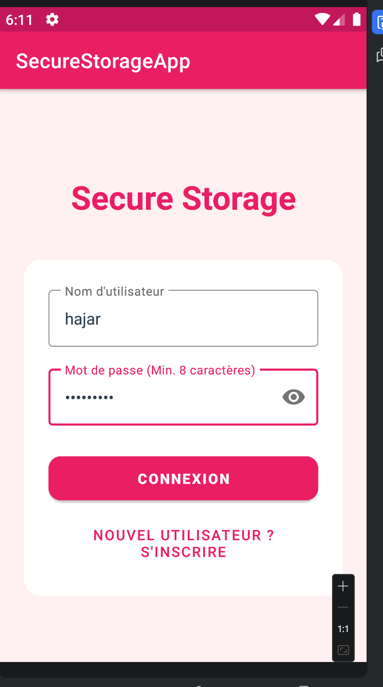 | 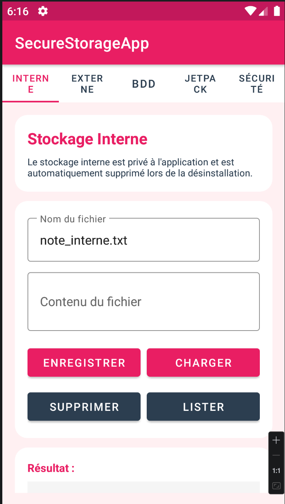 | 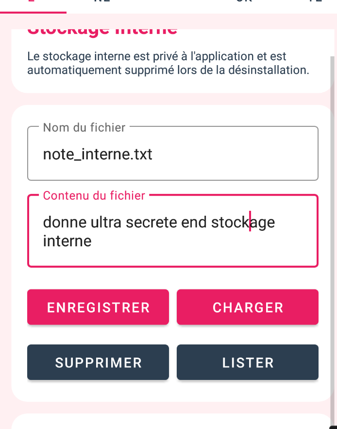 |
| Demande l'email et le mot de passe utilisateur pour ouvrir la session sécurisée. | Génère un sel aléatoire de 16 octets et dérive le mot de passe via PBKDF2. | Affiche les options de l'application une fois la session ouverte. |

---

## 3. Étape 2 : Stockage Interne avec Chiffrement Symétrique (AES-256)
Le stockage interne est chiffré au niveau applicatif à l'aide d'une clé AES-256 générée dynamiquement et stockée de manière sécurisée dans le Keystore Android.

### Spécifications Techniques
* **Algorithme de chiffrement** : AES/GCM/NoPadding (chiffrement authentifié garantissant l'intégrité et la confidentialité des fichiers).
* **Gestion des clés** : Clé maîtresse stockée dans le système d'authentification matériel du Keystore Android (TEE/StrongBox).
* **Contrôle d'accès** : Fichiers stockés dans le répertoire privé (`context.getFilesDir()`), inaccessibles aux autres applications du système.

### Démonstration Visuelle du Stockage Interne

| Sauvegarde des données | Liste des fichiers chiffrés |
| :---: | :---: |
| **Écriture chiffrée** | **Visualisation interne** |
| 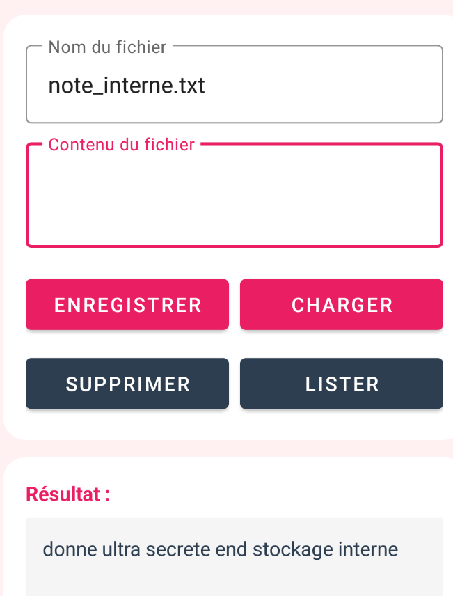 | 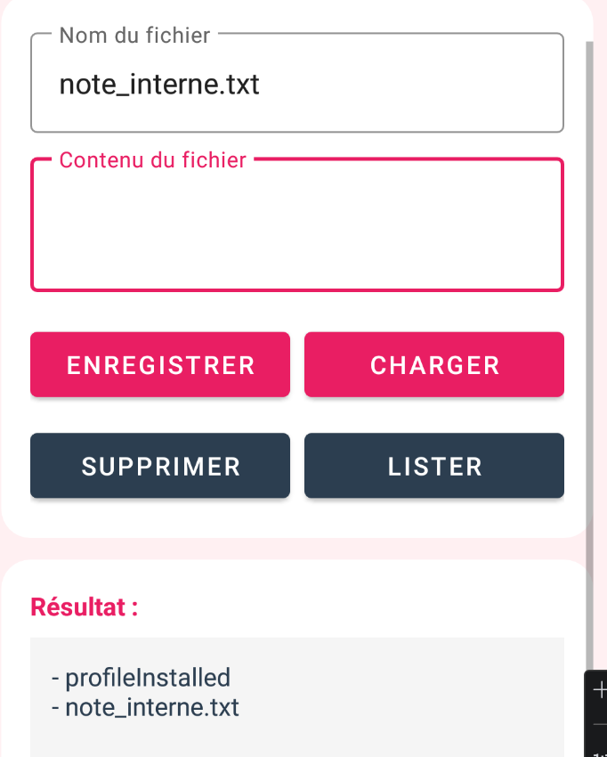 |
| Saisie et chiffrement instantané des textes saisis en AES-256-GCM. | Liste des documents stockés de façon étanche dans la sandbox interne. |

---

## 4. Étape 3 : Stockage Externe et Scoped Storage
Sur les versions modernes d'Android, l'accès au stockage externe partagé est restreint pour préserver la vie privée des utilisateurs. L'application implémente le modèle **Scoped Storage**.

### Spécifications Techniques
* **Emplacement** : Utilisation du répertoire externe spécifique à l'application (`context.getExternalFilesDir()`).
* **Avantage de sécurité** : Ne requiert aucune permission globale en écriture/lecture (comme `WRITE_EXTERNAL_STORAGE`), limitant ainsi le privilège accordé à l'application.
* **Comportement système** : Les fichiers stockés dans cet espace sont automatiquement supprimés lors de la désinstallation de l'application.

### Démonstration Visuelle du Stockage Externe

| Fichier externe applicatif | Lecture du stockage externe | Visualisation des ressources |
| :---: | :---: | :---: |
| **Écriture externe** | **Lecture externe** | **Contrôle des fichiers** |
| 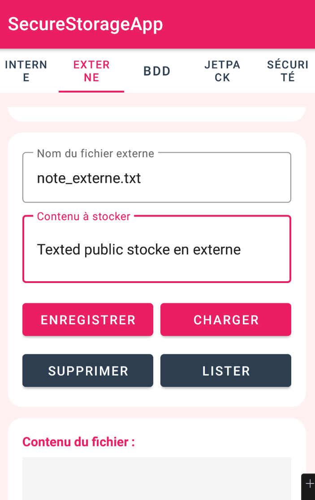 | 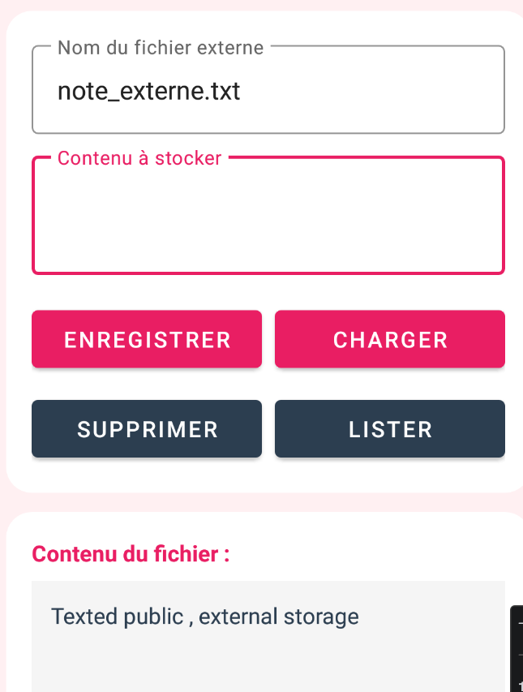 | 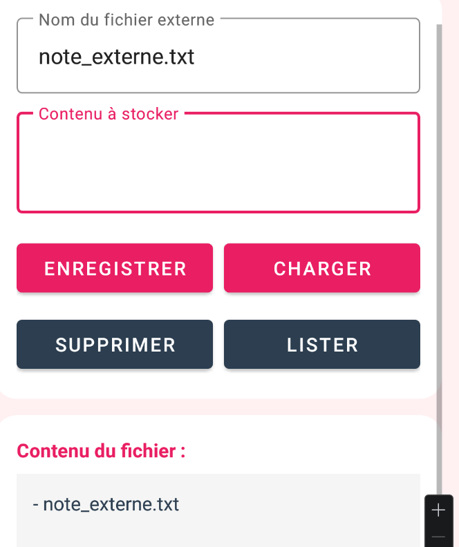 |
| Sauvegarde des documents texte dans le dossier externe alloué à l'application. | Déchiffrement et chargement des données lues depuis le support externe. | Visualisation de l'ensemble des documents enregistrés sur l'espace externe. |

---

## 5. Étape 4 : Base de Données Room Chiffrée (SQLCipher)
La persistance structurée de l'application repose sur le framework ORM **Room**, sécurisé par la bibliothèque de chiffrement de base de données **SQLCipher**.

### Spécifications Techniques
* **Moteur de chiffrement** : SQLCipher (chiffrement complet des pages SQLite).
* **Algorithme** : AES-256 en mode CBC avec dérivation de clé PBKDF2.
* **Intégration** : Initialisation via le chargement dynamique des bibliothèques natives (`SQLiteDatabase.loadLibs(context)`) et l'injection d'un support de base de données d'usine (`SupportFactory`) configuré avec une phrase de passe cryptographique.

### Démonstration Visuelle de la Base de Données (Partie 1)

| Gestion de la Base | Ajout d'une Note | Validation de Saisie |
| :---: | :---: | :---: |
| **Console SQLCipher** | **Création de contenu** | **Validation** |
| 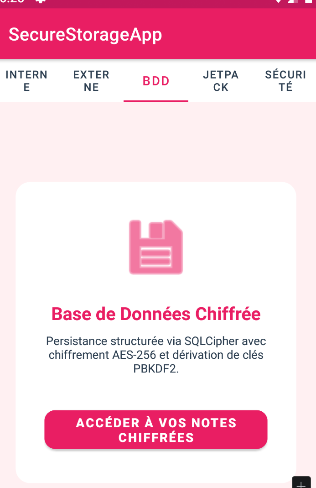 |  | 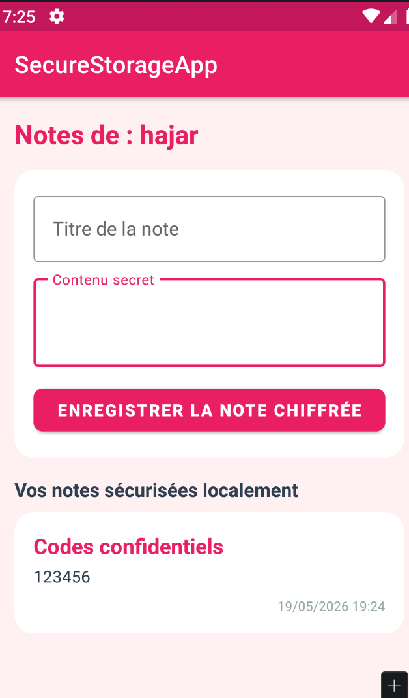 |
| Interface d'accès au module de base de données relationnelle sécurisée. | Ajout d'une note confidentielle avec titre et description. | Contrôle de la conformité des données avant insertion chiffrée. |

### Démonstration Visuelle de la Base de Données (Partie 2)

| Confirmation d'écriture | Liste des notes chiffrées | Décryptage dynamique |
| :---: | :---: | :---: |
| **Validation d'écriture** | **Déchiffrement à la volée** | **Consultation sécurisée** |
| 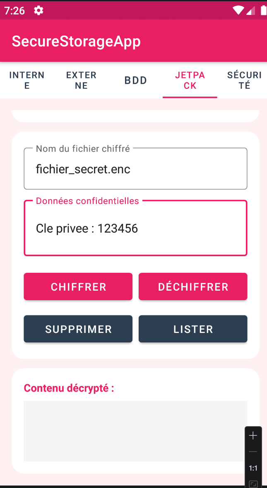 | 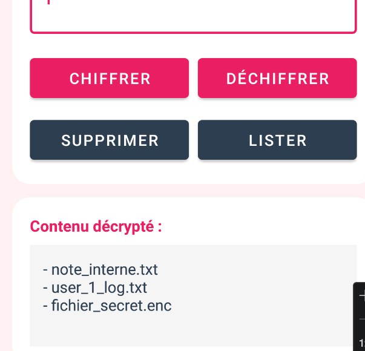 | 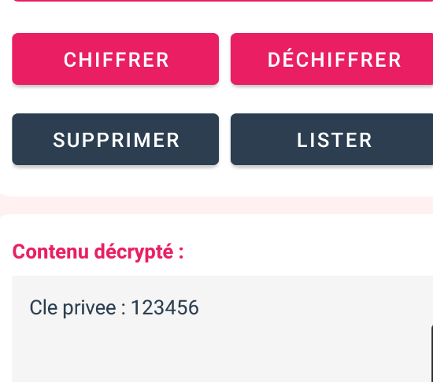 |
| Enregistrement définitif dans le fichier SQLite chiffré par SQLCipher. | Liste des notes déchiffrées dynamiquement lors de la consultation. | Sélection et décryptage individuel sécurisé d'une note spécifique. |

---

## 6. Étape 5 : Analyseur de Sécurité et Console Interactive de Remédiation
Pour valider l'état de sécurité global du terminal, le dernier module est un tableau de bord de diagnostic de sécurité dynamique qui analyse l'environnement en temps réel.

### Vulnérabilités Analysées
* **Sauvegardes de Données (`allowBackup`)** : Vérifie si la configuration autorise la sauvegarde ADB des données privées (Risque élevé de fuite).
* **Disponibilité de la StrongBox** : Détermine si l'appareil possède une puce physique de protection des clés (HSM).
* **Mode Debugging (`debuggable`)** : Détecte si l'application est compilée avec les drapeaux de débogage actifs.
* **Environnement d'Exécution (Émulateur)** : Analyse le matériel pour interdire l'exécution dans des environnements de virtualisation non contrôlés.

### Démonstration Visuelle du Diagnostic de Sécurité

| Rapport d'Audit Initial | Détail Vulnérabilité HIGH | Détail Vulnérabilité LOW |
| :---: | :---: | :---: |
| **Bilan de santé global** | **Alerte Mode Debug** | **Alerte Émulateur** |
| 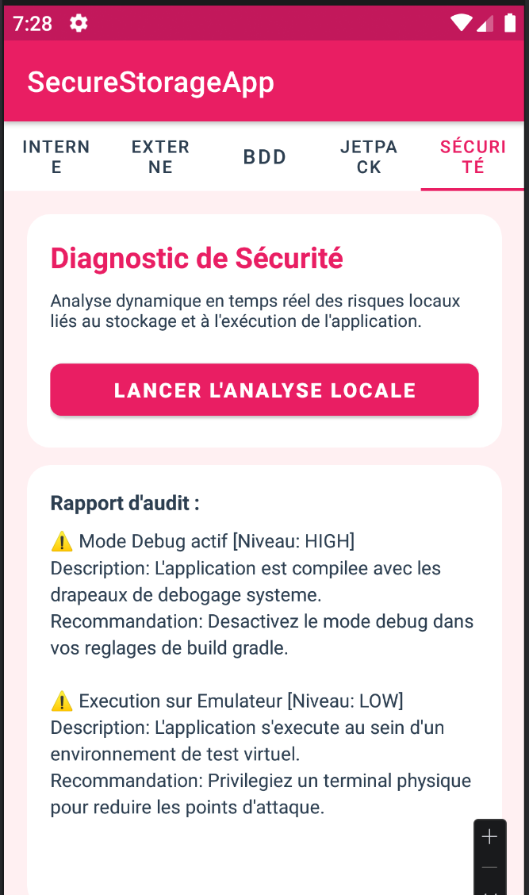 | 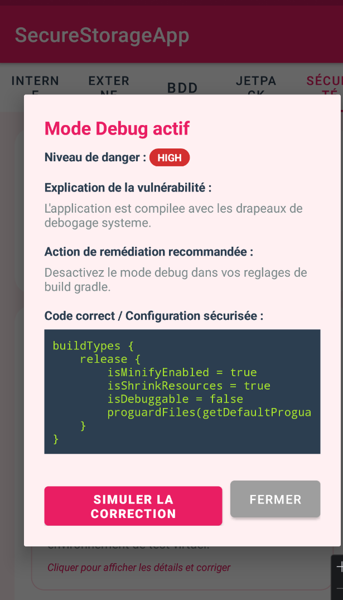 | 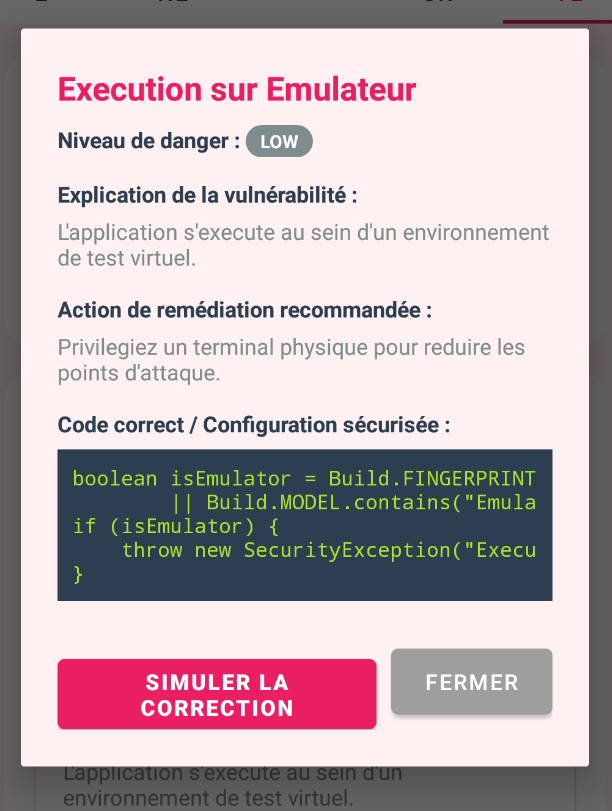 |
| Analyse des anomalies avec des cartes cliquables pour chaque alerte. | Explication théorique, impact et console de code de remédiation. | Console interactive et bouton de simulation de correction. |

---

## 7. Synthèse des Mécanismes de Protection

| Type de Donnée | Emplacement Physique | Algorithme / Technologie | Statut de Protection |
| :--- | :--- | :--- | :--- |
| Mots de passe | Base de données Room | PBKDF2WithHmacSHA256 | Haché avec sel unique |
| Fichiers internes | `/data/data/.../files/` | AES-256-GCM | Chiffrement symétrique |
| Fichiers externes | `/sdcard/Android/data/...` | Scoped Storage | Isolement sandbox |
| Données structurées | Base SQLite Room | SQLCipher (AES-256-CBC) | Base entièrement chiffrée |
| Clés cryptographiques | Keystore Android | Keystore Hardware (TEE) | Stockage inviolable |

---

## 8. Démonstration Vidéo de l'Application
https://github.com/user-attachments/assets/e444e5e0-4f24-4ebc-92ca-79702bd183f1
